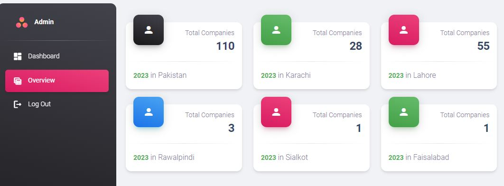

# Pakistani Software Companies Dashboard

This Django web application provides a dashboard for visualizing data about Pakistani software companies, including their clients, locations, and ratings. The application features user authentication (login, register, logout) and dynamic data visualization using a real-life dataset of Pakistani software companies.


## Features

- **User Authentication**: Secure login, registration, and logout functionalities using Django's built-in authentication system.
- **Dashboard**: An overview of software companies across various cities in Pakistan with visualizations and tables.
- **Data Visualization**: Displays company data using charts and tables for better insights.
- **Raw SQL Queries**: Utilizes raw SQL queries for efficient data retrieval.

### Overview
- Dashboard

An overview of software companies across various cities in Pakistan with visualizations and tables

- Charts.js

Displays distribution of companies across major cities and number of top-rated companies in each major city.
## Installation

1. **Clone the repository:**
    ```bash
    git clone https://github.com/Sohail342/Pakistani_IT_Companies_Django.git
    cd pakistani-software-companies-dashboard
    ```

2. **Create a virtual environment:**
    ```bash
    python3 -m venv env
    source env/bin/activate  # On Windows use `env\Scripts\activate`
    ```

3. **Install dependencies:**
    ```bash
    pip install -r requirements.txt
    ```

4. **Run migrations:**
    ```bash
    python manage.py migrate
    ```
5. **If you want to Insert my dataset of pakistani software Companies, run the command (optional) :**
```bash
python manage.py insert_company_data  # User Created Command
```

6. **Create a superuser:**
    ```bash
    python manage.py createsuperuser
    ```

7. **Run the development server:**
    ```bash
    python manage.py runserver
    ```

8. **Access the application:**
    Open your browser and go to `http://127.0.0.1:8000`

## Usage

### Dashboard

The dashboard provides an overview of the total number of companies and their distribution across major cities in Pakistan, including Karachi, Lahore, Islamabad, Rawalpindi, Sialkot, Faisalabad, and Bahawalpur. It also displays the most highly-rated companies in these locations.

### Charts

The application includes dynamic charts to visualize company data:

- **Doughnut Chart:** Distribution of companies across major cities.
- **Bar Chart:** Number of top-rated companies in each major city.

### Tables

Detailed tables are available to showcase:

- **Top-Rated Companies:** Companies with the highest ratings.
- **City-Specific Companies:** Companies located in Karachi, Lahore, and Islamabad.

### Raw SQL Queries

Efficient data retrieval is achieved through raw SQL queries for specific data requirements.

## Code Overview

### Views

- **Dashboard View:** Displays the dashboard with charts and tables.
- **Tables View:** Shows detailed tables of top-rated and city-specific companies.

### Models

- **Company Model:** Represents a software company with fields for name, location, and rating.
- **Client Model:** Represents clients associated with a company.

### Raw SQL Query Example

```python
def fetch_company_details():
    with connection.cursor() as cursor:
        cursor.execute("""
            SELECT c.company_name, c.location, cl.company_clients
            FROM core_company c
            JOIN core_client cl ON c.id = cl.company_id
        """)
        rows = cursor.fetchall()
        return rows
```

## Contact
If you have any questions or feedback, feel free to reach out:
<p align="left">
<a href="https://wa.me/+923428041928" target="blank"></a>
<a href="https://www.hackerrank.com/sohail_ahmad342" target="blank"></a>
<a href="https://www.linkedin.com/in/sohailahmad3428041928/" target="blank"></a>
<a href="https://instagram.com/sohail_ahmed113" target="blank"></a>
<a href="mailto:sohailahmed34280@gmail.com" target="blank"></a>
</p>

